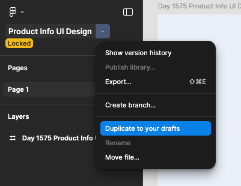
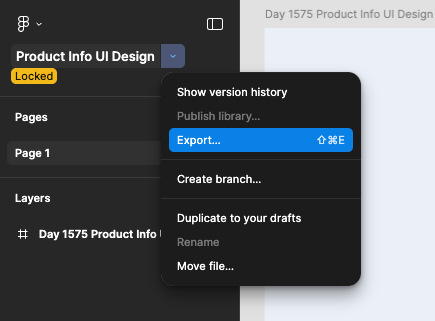

# TH Day 02

1. Đăng ký tài khoản Figma, tải figma về và cài đặt.
   `https://www.figma.com/downloads`
2. Khi sử dụng đề, ấn file -> duplicate để tạo bản sao của đề về tài khoản của mình.
   
3. Tìm hiểu về Figma, cách sử dụng, các công cụ cơ bản.
4. Export ảnh hàng loạt và lưu vào thư mục đã tạo sẵn trên máy tính.
   
5. Hiểu cách phân tích bố cục của thiết kế để code HTML chuẩn.
   
6. Hiểu cơ bản về cách sử dụng class.
7. Hiểu cách sử dụng icon, img, background-image trong CSS.

```html
<link
	rel="stylesheet"
	href="https://cdnjs.cloudflare.com/ajax/libs/font-awesome/7.0.1/css/all.min.css"
	integrity="sha512-2SwdPD6INVrV/lHTZbO2nodKhrnDdJK9/kg2XD1r9uGqPo1cUbujc+IYdlYdEErWNu69gVcYgdxlmVmzTWnetw=="
	crossorigin="anonymous"
	referrerpolicy="no-referrer"
/>
```
